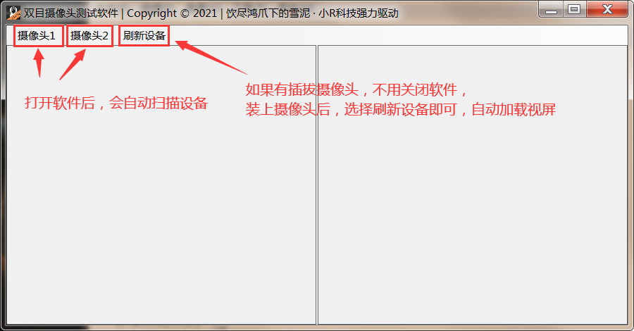

# Binocular Camera
双目USB摄像头测试软件工程，可以在这里直接下载[可执行程序](https://github.com/ceoifung/BinocularCamera/releases/download/v1.0.0/BinocularCamera.exe)

## 1. 软件主界面

- 摄像头1 & 摄像头2：将摄像头的USB口插入电脑后，打开软件，软件会自动扫描设备，自动打开视频；如果长时间没有加载视频，那么请点击刷新设备按钮，如果刷新后也没有画面，那么请检查摄像头与电脑的连接是否有问题。
- 刷新设备：当测完一个摄像头设备后，无需关闭软件，下次插入摄像头后，点击该按钮，摄像头画面会自动加载，前提是摄像头与电脑的连接正常

## 2. 支持设备

本软件支持**双目摄像头**以及**普通摄像头**

## 3. 注意情况

### 3.1 双目摄像头

如果是测试双目摄像头，尽量**不要将摄像头接在USB HUB上**，因为某些**USB HUB不支持同时加载两路视频**，从而导致软件无法同时显示画面。推荐直接将摄像头接在电脑上。

### 3.2 普通摄像头

接入普通摄像头后，画面会显示在左边的窗格

